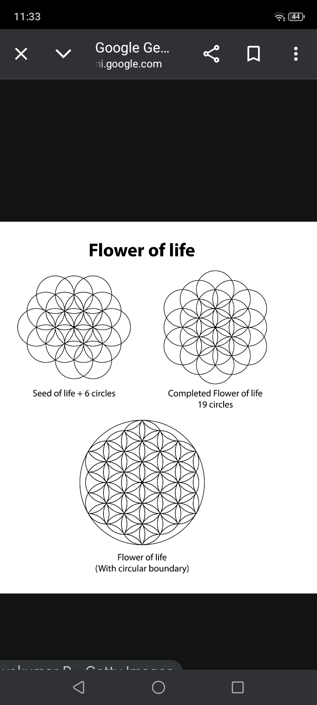

# CHAPTER 2: THE ENGINE (SPIN)
### How to Move Reality (3-6-9)

**COMPONENT:** V-GEARBOX
**FUNCTION:** TIME CONTROL

---

## 1. THE ILLUSION OF TIME
Time is not a straight line. Time is a **SPIRAL**.
* **Future:** Does not exist yet. It is pure Energy ($X$).
* **Past:** Is dead. It is Crystalized Data ($Z$).
* **NOW:** This is the only place where the Engine spins.

**PHYSICS OF SPIN:**
* To create **GRAVITY** (Attract things/money/health) -> You must spin INWARD (Implosion).
* To create **RADIATION** (Share light/love) -> You must spin OUTWARD (Explosion).

---

## 2. THE TESLA CODE (3-6-9)
Why did Tesla say 3-6-9 is the key? Because it describes the **Geometry of Spin**.

* **1, 2, 4, 8, 7, 5:** This is the pattern of Matter (Cell division). It is the "Matrix".
* **3, 6:** These are the **PULSES** (Oscillation). They are the magnetic field that controls the matter.
* **9:** This is the **VOID** (God/Center). The 9 is never changed. It is the axis.

> **ENGINEERING TRUTH:**
> You cannot change the Matter (1-2-4-8) by touching it.
> You can only change it by changing the Pulse (3-6) around the Axis (9).

---

## 3. THE FLOWER OF LIFE (GEARBOX)
Look at the "Flower of Life" pattern again.
It is not decoration. It is a schematic of **INTERLOCKING GEARS**.

* When you rotate one circle (Thought), the gears turn the next circle (Emotion), which turns the next circle (Body).
* **Friction:** If your Thought spins Right, but your Emotion spins Left -> You get Heat (Inflammation/Stress). This is **BAD ENGINEERING**.
* **Coherence:** All gears must spin in the Golden Ratio ($\phi$). This is called **FLOW**.

---

## 4. SYSTEM INSTRUCTION (HOW TO SPIN)
How do you use this in real life?

1.  **Locate the Axis (9):** Find the silence inside you. Stop the internal dialogue.
2.  **Set the Pulse (3-6):** Visualize the outcome (Intent $X$). Do not beg. Just vibrate at that frequency.
3.  **Engage Gravity:** Feel the emotion of *already having it*.
4.  **Result:** The reality ($Y$) will condense around you automatically.

> **WARNING:**
> Do not try to force the gears. If you hear "grinding" (Stress), STOP.
> Align the Axis first.
